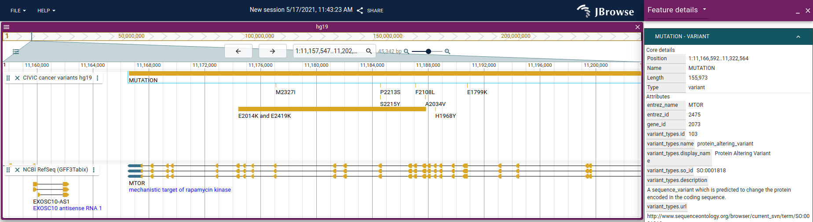

# jbrowse-plugin-civic

This plugin adapts the [CIVIC API](https://civicdb.org/)

## Demo

https://s3.amazonaws.com/jbrowse.org/code/jb2/main/index.html?config=https%3A%2F%2Funpkg.com%2Fjbrowse-plugin-civic%2Fdist%2Fconfig.json

## Screenshot



## To use in jbrowse-web

Add to the "plugins" of your JBrowse Web config:

```json
{
  "plugins": [
    {
      "name": "CIVIC",
      "url": "https://unpkg.com/jbrowse-plugin-civic/dist/jbrowse-plugin-civic.umd.production.min.js"
    }
  ]
}
```

You can also download this file to your local server if you don't want to use a CDN

## To use in embedded @jbrowse/react-linear-genome-view

See [DEVELOPERS.md](DEVELOPERS.md)
